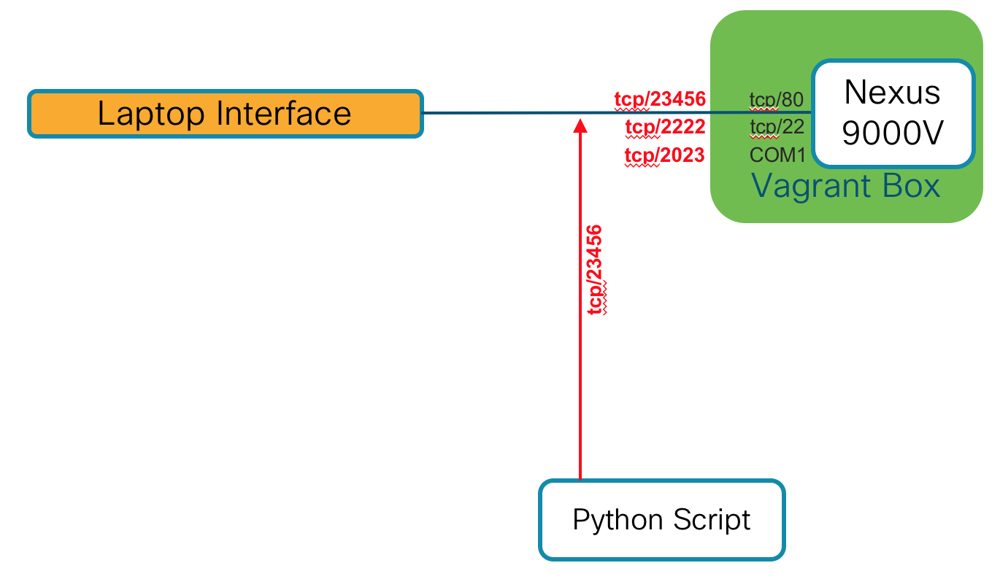

# DEVWKS-2594: 01-generate

Simple Python script to query the NXAPI and generate metrics
that will be collected by another phase.

## Outcomes

- Demonstrate use of the requests module
- Examples of navigating returned data structure

## Pre-requisites

- [Vagrant Box Instructions](../00-n9kv/README.md)
  - Must have Nexus 9000v Vagrant box running
  - Must have iCAM enabled via **setup_nxos.py** script
- [Python environment activated](../README.md)

## How to use

```bash
python generate.py
```

## General explanation (for self study participants)

### Network Communication Diagram



### Main body of script

The script we are writing is a metric generation script - so basic operation
involves repeatedly querying the switch for data.  That's the primary driver
for the loop structure.

Each iteration we should have a timestamp with the metric being generated and
the loop must behave like a standard poller, waiting some amount of time being
generation calls.

### Generate method

I've set this up so that the "payload" that we see in the sandbox is a template.
In this way, the code in the method (a Python "function") stays clean and 
readable - which is a main design "best practice" in Python.

We populate the template with the CLI commands that will generate our desired
output like this:

```python
command['params']['cmd'] = 'show icam resource fib-tcam module 1 inst 0'
command['id'] = 1
```

That payload must be **POST**ed (HTTP POST) to the Nexus NX-API web service
and the response parsed/processed.

Because the json returned can have a fairly deep tree - see
[the raw JSON](icam.fib-tcam.output.json) - and Python has some specific, coding
style guidelines ([PEP8](https://www.python.org/dev/peps/pep-0008/)), I have
created a variable (table_data) that essentially points to the top of the tree
where our results of interest begins.

From there, I am simply extracting table data for entry 2 (list element '1')
for our metric.
