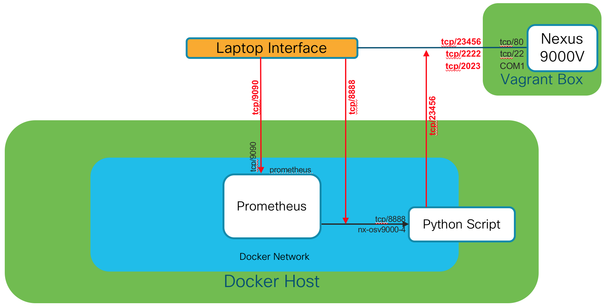

# 02-collect

This module demonstrates the collection aspects of metrics
analytics in which we need to update the script and add a
collection tool (Prometheus)

The standalone generate.py script is updated to:

- Generate more metrics
- Add instrumentation to support collection by Prometheus
- Support operation of script within a Docker container

To support demonstrating the collection, we'll use Docker and
the existing Prometheus project's container.

## Encapsulate your script into a Docker container

Build the Docker image for this command:

    docker build -t devwks-2594/collect:latest -t devwks-2594/collect:1 .

## Deploy your collector and Prometheus service

### Create the Docker Network

    docker network create --driver=bridge --subnet=192.168.254.0/24 \
                          --gateway=192.168.254.254 --attachable demo0

### Deploy Prometheus container

    docker run --name prometheus -d --network demo0 \
               -p 127.0.0.1:9090:9090 \
               -v ${PWD}/prometheus.yml:/etc/prometheus/prometheus.yml \
               quay.io/prometheus/prometheus

### Deploy our collection script

    docker run --name collector -d --network demo0 \
               -p 127.0.0.1:8888:8888 \
               devwks-2594/collect

### Shortcut for Prometheus graphs

    http://localhost:9090/new/graph?g0.expr=icam_fib_tcam_ipv4_host_routes&g0.tab=0&g0.stacked=0&g0.range_input=1h&g1.expr=icam_fib_tcam_ipv4_lpm_routes&g1.tab=0&g1.stacked=0&g1.range_input=1h&g2.expr=icam_fib_tcam_ipv4_routes&g2.tab=0&g2.stacked=0&g2.range_input=1h&g3.expr=process_start_time_seconds&g3.tab=0&g3.stacked=0&g3.range_input=1h&g4.expr=process_cpu_seconds_total&g4.tab=0&g4.stacked=0&g4.range_input=1h&g5.expr=&g5.tab=1&g5.stacked=0&g5.range_input=1h

## Architecture

Our Nexus 9300v image is a Vagrant box, meaning a VM running in
VirtualBox.  Our Prometheus service and collection scripts are
running as containers in Docker.  This adds a bit of complexity
with regards to the different internal networks running in Mac OS X,
VirtualBox. and Docker.

Here's a diagram illustrating the components of this module to clearly
show how the components are interoperate:

## General explanation

Our generation script will undergo a couple of functional changes
in order to support operation as a container and as a prometheus
collection target.

To act as a prometheus client, we simply need to invoke the related
Prometheus methods that:

- Start the Prometheus controlled web service
- Create the metric collection objects for our data
- Populate those objects with our data

I've added a few more metrics that can be generated as part of the
same command as well.

To help clean up the readability of the script, I've also abstract
out all the connection details for communication with the Nexus switch
into two files:

- [payloads.py](payloads.py)
- [connection.py](connection.py)

This abstraction shows how relatively straightforward it is to clean
up your code for easy re-use and readability.

## Background information

Leveraging specific Docker networking DNS entries to have script talk to host

- [Docker for Mac](https://docs.docker.com/docker-for-mac/networking/#use-cases-and-workarounds)
