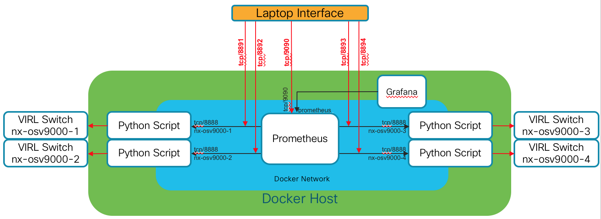

# 03-visualize

The goal of this module is to focus on visualization of our metrics
with Grafana, leveraging our custom generation script (now called
**visualize.py** in this module) and Prometheus.

We are also going to demonstrate how the same script can be used
on multiple switches, collected in a scalable way, and visualized
intelligently within Grafana.

## Build Docker container that contains your script

Build the Docker image for this command:

```bash
    docker build -t devwks-2594/visualize:latest -t devwks-2594/visualize:1 .
```

## Deploy containers in the DevNet Sandbox

Create the new Docker bridge network **demo0** (only if 'docker network list'
doesn't show the network):

```bash
    docker network create --driver=bridge --subnet=192.168.254.0/24 \
                          --gateway=192.168.254.254 --attachable demo0
```

Build the Docker image for this command:

```bash
    docker build -t devwks-2594/visualize:latest -t devwks-2594/visualize:1 .
```

Fire up the 4 collectors to monitor the 4 Nexus 9000v switches - note, the IP
address below (10.10.20.70) might be different when you reserve your own Sandbox.
The IP is merely the address of the Developer Server in the Sandbox pod:

```bash
    docker run --name nx-osv9000-1 -d --network demo0 -p 10.10.20.70:8891:8888 \
            -e "NXAPI_HOST=172.16.30.101" -e "NXAPI_PORT=80" \
            -e "NXAPI_USER=cisco" -e "NXAPI_PASS=cisco" \
            devwks-2594/visualize
    docker run --name nx-osv9000-2 -d --network demo0 -p 10.10.20.70:8892:8888 \
            -e "NXAPI_HOST=172.16.30.102" -e "NXAPI_PORT=80" \
            -e "NXAPI_USER=cisco" -e "NXAPI_PASS=cisco" \
            devwks-2594/visualize
    docker run --name nx-osv9000-3 -d --network demo0 -p 10.10.20.70:8893:8888 \
            -e "NXAPI_HOST=172.16.30.103" -e "NXAPI_PORT=80" \
            -e "NXAPI_USER=cisco" -e "NXAPI_PASS=cisco" \
            devwks-2594/visualize
    docker run --name nx-osv9000-4 -d --network demo0 -p 10.10.20.70:8894:8888 \
            -e "NXAPI_HOST=172.16.30.104" -e "NXAPI_PORT=80" \
            -e "NXAPI_USER=cisco" -e "NXAPI_PASS=cisco" \
            devwks-2594/visualize
```

Deploy Prometheus container:

```bash
    docker run --name prometheus -d --network demo0 \
            -p 10.10.20.70:9090:9090 \
            -v ${PWD}/prometheus.yml:/etc/prometheus/prometheus.yml \
            quay.io/prometheus/prometheus
```

Deply Grafana container:

```bash
    docker run --name grafana -d --network demo0 \
            -p 10.10.20.70:3000:3000 \
            grafana/grafana
```

Please note - while building the DevNet Sandbox environment offers a lot of
convenience, it may take some time before the Prometheus container actually
shows collected data.  You can validate that Prometheus is functional and able
to connect to the Nexus 9000v collectors by visiting the
[Prometheus Target Status](http://10.10.20.70:9090/targets) page.  Each target
should have a status of "UP".

## Demonstration Waypoints

### Examine raw data within Prometheus

These examples reference building the generation, collection, and visualization
components within the DevNet Sandbox environment.  If you build it locally, simply
replace the IP address *10.10.20.70* with *127.0.0.1*

Open a web browser and connect to the Prometheus service running in a container -
[http://10.10.20.70:9090/](http://10.10.20.70:9090/)

1. Plot the counts of paths for each IP Prefix
   - Select **ip_prefix_path_count** from the dropdown list and click *Execute*

2. Plot data solely related to **leaf2**
   - Click *Add Graph* to add another graph
   - Enter **ip_prefix_path_count{job="nxapi_leaf2"}** into *Expression* box and click *Execute*

3. Plot the IP traffic for each interface
   - Click *Add Graph* to add another graph
   - Enter **ip_prefix_path_traffic** into *Expression* box and click *Execute*

Shortcut, direct URL for all the relevant graphs:

[Direct URL to local Prometheus](http://10.10.20.70:9090/new/graph?g0.expr=ip_prefix_path_count&g0.tab=0&g0.stacked=0&g0.range_input=1h&g1.expr=ip_prefix_path_traffic&g1.tab=0&g1.stacked=0&g1.range_input=1h&g2.expr=ip_prefix_path_uptime&g2.tab=0&g2.stacked=0&g2.range_input=1h&g3.expr=ip_prefix_path_count%7Bjob%3D%27nxapi_leaf2%27%7D&g3.tab=0&g3.stacked=0&g3.range_input=1h)

## Architecture of this module - VXLAN Fabric

To provide the multiple switch environment, we will leverages the
"Open NX-OS with Nexus 9Kv On VIRL" DevNet Sandbox found at
[http://devnetsandbox.cisco.com/](http://devnetsandbox.cisco.com/).

As part of Cisco Live, a set of sandboxes has been pre-generated and
pre-configured on your behalf in the interests of time. Connection
information is provided for each of the workbench laptops.

For those using this material as a self-study guide, the required
setup steps are:

- Reserve the above sandbox
- Use the sandbox instructions to VPN into the sandbox
- Check out the code and follow the Python environment setup steps
- Follow the instructions in the [Ansible](ansible/README.md) directory

To generate traffic automatically for the fabric so that you can collect
metrics, you can run **in a separate window** the traffic.py Python script
which will spawn 4 processes that will start ping jobs on each of the
Nexus switches.

```bash
python traffic.py
```

## Network Communication Diagram



## Operational Deployment (local laptop)

Create a Docker network to which the containers will connect:

```bash
    docker network create --driver=bridge --subnet=192.168.254.0/24 \
                          --gateway=192.168.254.254 --attachable demo0
```

Deploy the four collector containers:

```bash
    docker run --name nx-osv9000-1 -d --network demo0 -p 127.0.0.1:8891:8888 \
            -e "NXAPI_HOST=172.16.30.101" -e "NXAPI_PORT=80" \
            -e "NXAPI_USER=cisco" -e "NXAPI_PASS=cisco" \
            devwks-2594/visualize
    docker run --name nx-osv9000-2 -d --network demo0 -p 127.0.0.1:8892:8888 \
            -e "NXAPI_HOST=172.16.30.102" -e "NXAPI_PORT=80" \
            -e "NXAPI_USER=cisco" -e "NXAPI_PASS=cisco" \
            devwks-2594/visualize
    docker run --name nx-osv9000-3 -d --network demo0 -p 127.0.0.1:8893:8888 \
            -e "NXAPI_HOST=172.16.30.103" -e "NXAPI_PORT=80" \
            -e "NXAPI_USER=cisco" -e "NXAPI_PASS=cisco" \
            devwks-2594/visualize
    docker run --name nx-osv9000-4 -d --network demo0 -p 127.0.0.1:8894:8888 \
            -e "NXAPI_HOST=172.16.30.104" -e "NXAPI_PORT=80" \
            -e "NXAPI_USER=cisco" -e "NXAPI_PASS=cisco" \
            devwks-2594/visualize
```

Deploy Prometheus container:

```bash
    docker run --name prometheus -d --network demo0 \
            -p 127.0.0.1:9090:9090 \
            -v ${PWD}/prometheus.yml:/etc/prometheus/prometheus.yml \
            quay.io/prometheus/prometheus
```

Deply Grafana container:

```bash
    docker run --name grafana -d --network demo0 \
            -p 127.0.0.1:3000:3000 \
            grafana/grafana
```

## References

A list of curated references for the technologies and demonstrations within
this stage of the presentation:

1. [Prometheus Querying Basic](https://prometheus.io/docs/prometheus/latest/querying/basics/)
